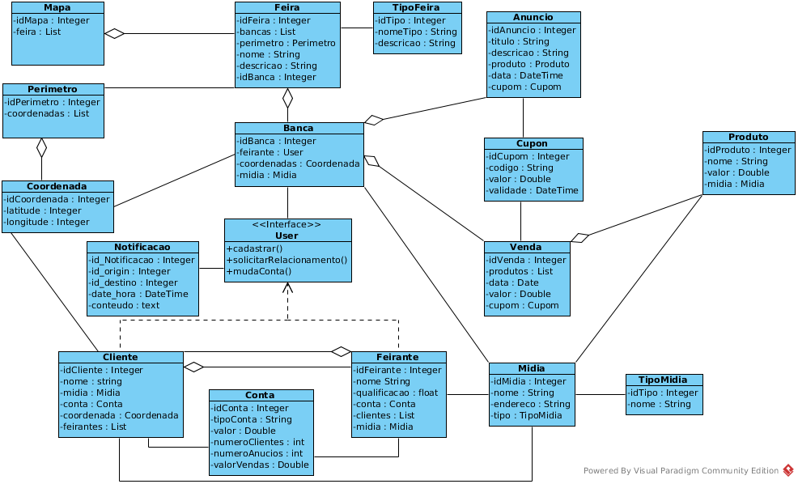
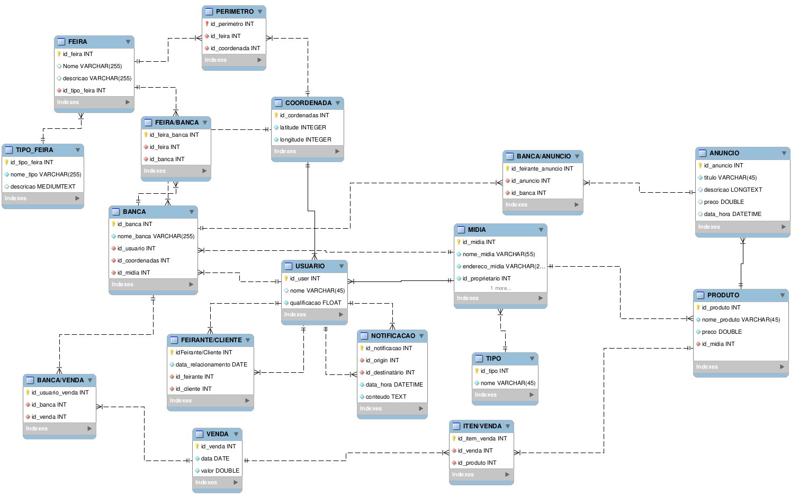
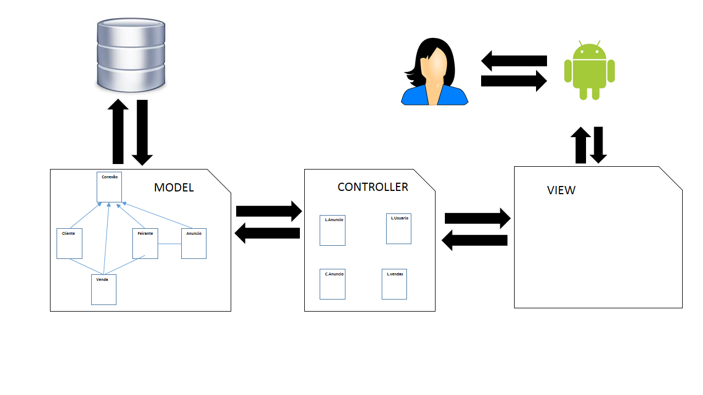

# Projeto-FindFer
Projeto de Aplicação de anúncios para feiras, desenvolvido durante a disciplina de programação corporativa

# Componentes:
Cícero
Fábio

# Descrição
O FindFer é uma platraforma de anúncios e vendas voltada específicamente para feiras, feirantes e clientes de
feiras, que visa criar uma conexão entre feirantes e seus clientes e potenciais clientes, insentivando as
pessoas a comprarem em feiras e aumentar o fluxo de pessoas nas feiras e consequentemente as vendas e proporcionar
uma forma de venda online para comodidade dos seus usuários.
# Diagrama de classes

# Modelo Entidade Relacionamento

# Diagrama de Estrutura da solução

 
